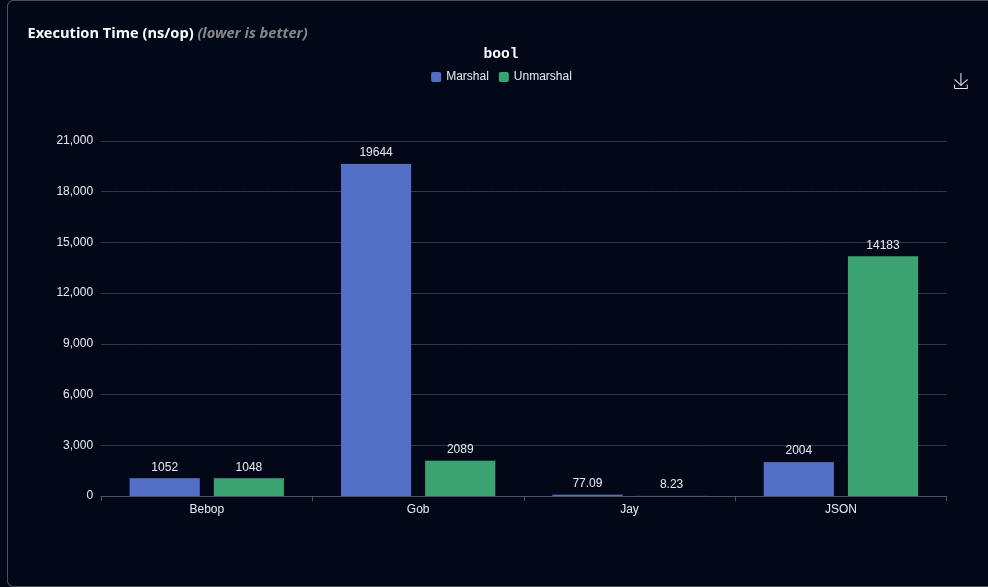

# Jay benchmarks

[Interactive HTML graphs](https://github.com/speedyhoon/Jay/blob/main/bench/graph.html).

Serialisation performance for 24 struct fields of various types using different technologies:

